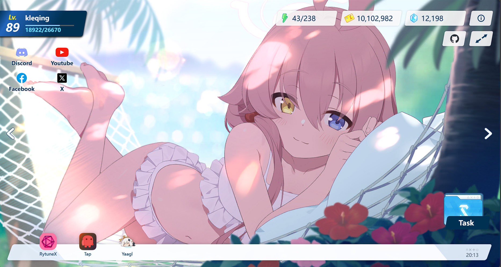

<h1 align="center">Blue Archive web page</h1>



## Credit

- Original repository: [homepage](https://github.com/sf-yuzifu/homepage)
- Original credit (2D model & others): [homepage](https://github.com/ElectroHeavenVN/homepage)

## Installation

> **Requirement**
>
> node > 18.0.0  
> npm > 8.15.0

1. Install yarn
```bash
# install yarn
npm install -g yarn
```

2. Open project 
3. Run these command:

```bash
# install yarn package 
yarn install

# Run
yarn dev

# Build
yarn build  
```